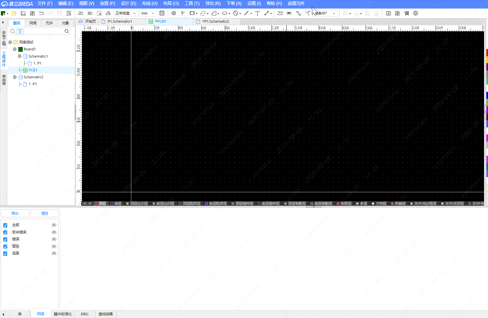

# 批量放置元件

[English](./README.en.md)

一个用于嘉立创EDA专业版的批量放置工具，支持通过CSV文件导入元件信息并自动放置到指定坐标位置。

## 支持功能

- **PCB封装放置**：在 PCB 中根据封装名批量放置元件
- **原理图符号放置**：在原理图中根据符号名批量放置元件

## 功能特性

- 支持从CSV文件批量导入元件信息
- 根据坐标信息精确放置元件到指定位置
- 智能单位转换：支持mm、mil、inch之间的自动转换
- 智能表头识别：自动从CSV表头提取单位信息（如：Name,X(mm),Y(mm)）
- 封装/符号名称和器件名称必须完全匹配才能放置
- 提供详细的成功/失败统计和错误信息
- 支持选择不同的元件库（系统库、个人库、项目库等）

## 使用方法

### 1. 准备CSV文件

创建一个CSV文件，格式为：`元件名称,X坐标,Y坐标`

#### PCB封装放置示例

**示例文件内容（示例封装数据.csv）：**
```csv
name,x,y
RELAY-TH_HVR24-2A04-02,0,0
CONN-TH_250-121,3000,0
RELAY-TH_HVR24-2A04-02,6000,0
SSOP-4_L2.7-W4.4-P1.27-LS7.0-BL,6000,1000
HDR-TH_SSW-101-03-G-S,9000,1000
```

**智能单位转换示例（使用mm单位）：**
```csv
Name,X(mm),Y(mm)
RELAY-TH_HVR24-2A04-02,0,0
CONN-TH_250-121,76.2,0
RELAY-TH_HVR24-2A04-02,152.4,0
SSOP-4_L2.7-W4.4-P1.27-LS7.0-BL,152.4,25.4
HDR-TH_SSW-101-03-G-S,228.6,25.4
```

#### 原理图符号放置示例

**示例文件内容（示例符号数据.csv）：**
```csv
name,x,y
HHW32GS62C-B1,30,10
STM32F103C8T6,60,10
LM358,90,10
```

**智能单位转换示例（使用mm单位）：**
```csv
Name,X(mm),Y(mm)
HHW32GS62C-B1,762,254
STM32F103C8T6,1524,254
LM358,2286,254
```

**格式说明：**
- 第一列：元件名称（封装模式匹配封装名称，符号模式匹配符号名称）
- 第二列：X坐标
- 第三列：Y坐标
- 支持带表头的CSV文件（如示例所示）
- **智能单位转换**：
  - 支持在表头中指定单位：`Name,X(mm),Y(mm)` 或 `Name,X(mil),Y(mil)` 或 `Name,X(inch),Y(inch)`
  - 如果表头未指定单位，默认使用：PCB封装使用mil，原理图符号使用inch
  - 系统会自动转换为内部标准单位（PCB：mil，原理图：inch）

### 2. 设置元件库

1. 在编辑器中，点击菜单 **放置元件** → **设置**
2. 选择要使用的元件库类型：
   - **系统库**：使用系统默认元件库
   - **个人库**：使用个人创建的元件库
   - **工程库**：使用当前项目的工程库
   - **其他库**：选择其它团队

### 3. 批量放置元件

#### PCB封装放置
1. 在**PCB页面**中，点击菜单 **放置元件** → **批量放置**
2. 选择准备好的封装CSV文件
3. 扩展会自动解析CSV文件并开始放置封装



#### 原理图符号放置
1. 在**原理图页面**中，点击菜单 **放置元件** → **批量放置**
2. 选择准备好的符号CSV文件
3. 扩展会自动解析CSV文件并开始放置符号


**完成后会显示结果统计，详细错误信息可在日志面板查看。**

## 错误排查

如果放置失败，请检查以下项目：

- ✅ 元件名称是否与库中完全一致（区分大小写）
- ✅ 是否在正确的编辑器中使用（PCB/原理图）
- ✅ CSV文件格式是否正确
- ✅ 坐标数值是否为有效数字
- ✅ 表头中的单位格式是否正确（如：X(mm)、Y(mil)）
- ✅ 是否选择了正确的元件库
- ✅ 查看日志面板获取详细错误信息


